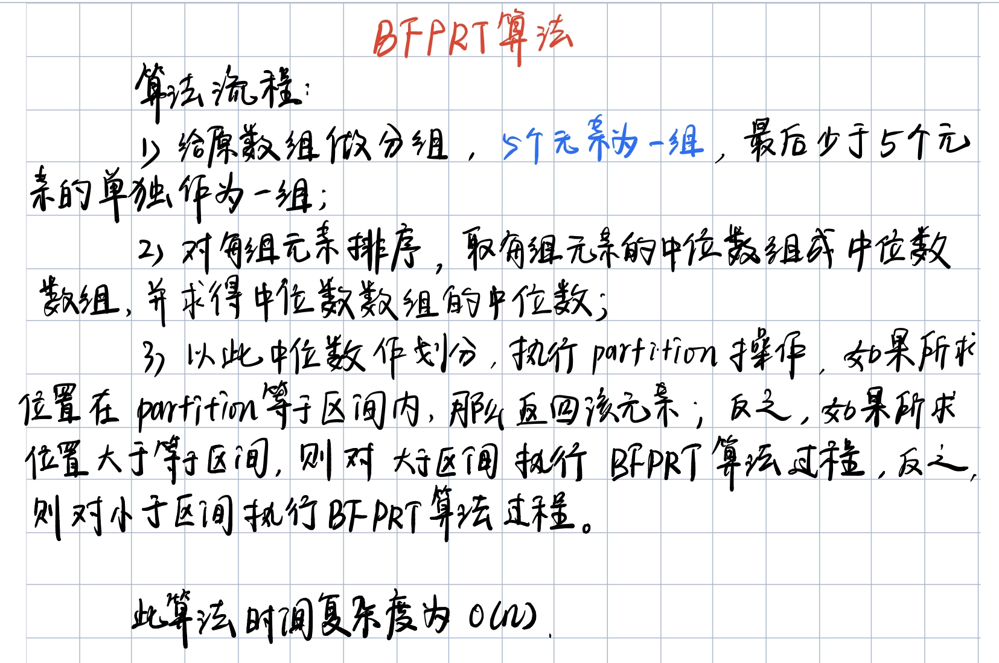

BFPRT 算法是一种用来求解`Top-K`问题的算法，其时间复杂度可以减小到`O(n)`。

<!-- more -->

## 基本过程


## 使用 BFPRT 求无序数组中第 k 小的元素，k 从 1 开始

```python
# -*- coding=utf-8 -*-
import random
import time


class BFPRT():
    """BFPRT 算法实现：
    BFPRT 算法用来求解 Top-K 问题，时间复杂度可以做到严格的 O(n)。
    """

    def bfprt(self, nums, k):
        """求得 nums 数组中第 k 小的元素，k 从 1 开始

        Args:
            nums (list): 给定数组
            k (int): 所求元素位置

        Returns:
            num_type: 所求元素
        """
        if not nums or not k:
            return None
        length = len(nums)
        if k > length:
            return None

        nums = list(nums)

        return self.process(nums, k-1, 0, length-1)

    def process(self, nums, k, begin, end):
        if begin == end:
            return nums[begin]

        pivot = self.get_median_of_medians(nums, begin, end)
        cur_range = self.partition(nums, pivot, begin, end)
        if k >= cur_range[0] and k <= cur_range[1]:
            return nums[k]
        elif k < cur_range[0]:
            return self.process(nums, k, begin, cur_range[0]-1)
        else:
            return self.process(nums, k, cur_range[1]+1, end)

    def partition(self, nums, pivot, begin, end):
        left = begin - 1
        cur = begin
        right = end + 1
        while cur < right:
            if nums[cur] == pivot:
                cur += 1
            elif nums[cur] < pivot:
                left += 1
                self.swap(nums, left, cur)
                cur += 1
            else:
                right -= 1
                self.swap(nums, right, cur)

        return left+1, right-1

    def get_median_of_medians(self, nums, begin, end):
        """取得中位数数组中位数"""

        cur_len = end - begin + 1
        offset = 0 if cur_len % 5 == 0 else 1
        medians = [0 for i in range(cur_len//5 + offset)]
        for i in range(len(medians)):
            begin_idx = begin + i * 5
            end_idx = begin_idx + 4
            medians[i] = self.get_median(nums, begin_idx, min(end_idx, end))
        return self.process(medians, len(medians)//2, 0, len(medians)-1)

    def get_median(self, nums, begin, end):
        """取得给定范围的上中位数"""

        self.insert_sort(nums, begin, end)
        mid = (begin + end) // 2
        return nums[mid]

    def insert_sort(self, nums, begin, end):
        for i in range(begin+1, end+1):
            for j in range(i, begin, -1):
                if nums[j] < nums[j-1]:
                    self.swap(nums, j, j-1)
                else:
                    break

    def swap(self, nums, i, j):
        nums[i], nums[j] = nums[j], nums[i]

class Check():
    """对数器"""

    def generate_nums(self, max_length, max_value):
        length = random.randint(0, max_length)
        nums = [random.randint(-max_value, max_value) for i in range(length)]

        return nums


def main():
    nums = [4, 5, 3, 2, 1, 6, 7]  # expect 4
    ex = BFPRT()
    ck = Check()
    max_length, max_value = 100, 100
    start = time.time()
    for i in range(10000):
        nums = ck.generate_nums(max_length, max_value)
        for i in range(len(nums)):
            res = ex.bfprt(nums, i+1)
            check_res = sorted(nums)[i]
            if res != check_res:
                print('oops, {}, {}, {}, {}', nums, i+1, res, check_res)
    print(time.time()-start)

if __name__ == "__main__":
    main()

```
**时隔两个月，再看自己代码，发现的确不咋认识了。而且发现了一个可以优化的地方。在求数组的中位数时，可以复用原来数组——将分组后每组求得的中位数和原数组对应下标为该组序号的数组元素互换，这样数组前面的部分就会是分组的中位数数组，然后再对这个中位数数组重复此过程，最终求到整个数组的中位数，然后继续`partition`过程。这样就可以节省掉原来的实现方法中每次临时开辟的数组空间。Nice.**
