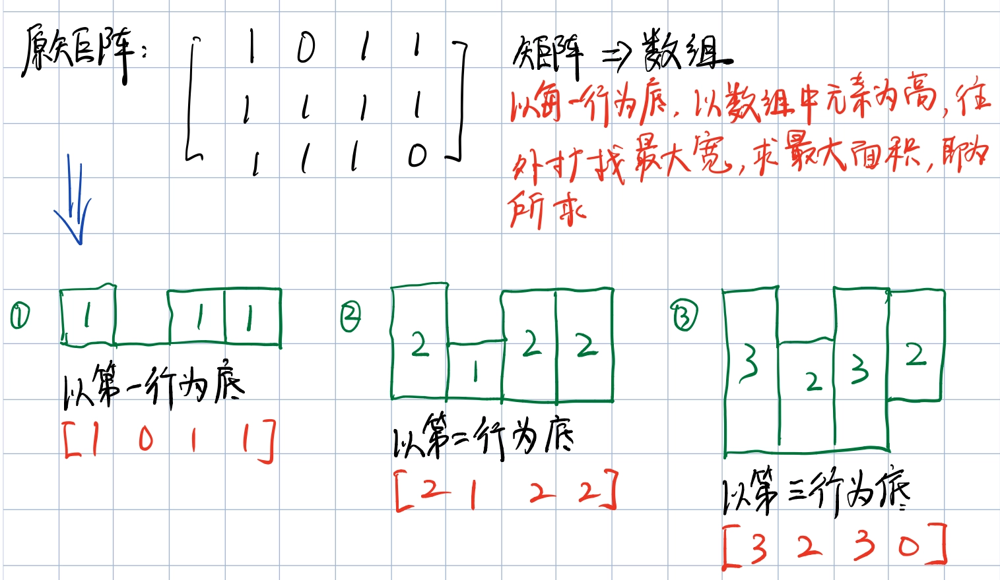

### 1. 单调栈求解的基本问题：
> 给定一个数组，求数组中每个元素左右两边离其最近的元素，要求时间复杂度 O(n)。


分析：
> 基本解法为对每一个元素，我们都遍历该元素两边的元素，然后都返回第一个比其小的元素。这样时间复杂度明显为 O(n\*n)。如果要满足时间复杂度要求，我们就要借助于单调栈来实现。

#### 单调栈思想：
> **栈中元素只能是单调的。** <br>
对于上题我们可以建立一个从底至顶递增的单调栈。<br>
在遍历数组元素的时候：<br>
&emsp;&emsp;1.如果栈不为空，且当前遍历到的元素小于栈顶元素，就把栈顶元素抛出直到栈为空或者栈顶元素小于当前遍历到的元素，然后把当前遍历到的元素压栈；<br>
&emsp;&emsp;2.如果栈为空，且当前遍历到的元素大于栈顶元素，那么就直接把当前遍历到的元素压栈；<br>
> 数组遍历完之后，如果栈不为空：<br>
&emsp;&emsp;从栈中抛出元素，此时从栈中抛出的元素右边没有比其小的值；

<!-- more -->

#### 代码：

```python
def monotone_stack(arr):
    """基础单调栈实现：求数组里每个元素左右离其最近的小于它的值；

    Arguments:
        arr {[list]} -- 【输入数组】

    Returns:
        [list] -- 【数组元素为列表，包含原数组对应下标值得左右最小值】
    """

    if arr is None or len(arr) < 1:
        return None

    res = {}
    stack = []

    for i in range(len(arr)):
        while stack and arr[i] < arr[stack[-1][0]]:
            item = stack.pop()
            for _ in item:
                res[_] = [arr[stack[-1][0]], arr[i]
                          ] if stack else [None, arr[i]]
        if stack and arr[i] == arr[stack[-1][0]]:
            stack[-1].append(i)
        else:
            stack.append([i])

    while stack:
        item = stack.pop()
        for _ in item:
            res[_] = [arr[stack[-1][0]], None] if stack else [None, None]

    return res
```

### 2. 求最大子矩阵的大小
#### 题意：
> 给定一个整型矩阵 map，其中的值只有 0 和 1 两种，求其中全是 1 的所有矩形区域中，最大的矩形区域为 1 的数量。<br>
例如：<br>
1 1 1 1<br>
其中，最大的矩形区域有 3 个 1，所以返回 3。<br>
再如：<br>
1 0 1 1<br>
1 1 1 1<br>
1 1 1 0<br>
其中，最大的矩形区域有 6 个 1，所以返回 6。

分析：<br>
> 单调栈相关的问题，有些时候就好像在拿着一把竖直的尺子从中间往两边扩，扩到规则限定的边界。比如在题 1 中就是扩到两边离它最近的比它小的值所在的地方。对于这个题，如果我们把结果要的小矩形的数量，转换为矩形的面积。那么就可以做到如下图的转化：



> 那么把以每一行为底得到的数组看做一个直方图数组，我们就可以利用单调栈求得每个直方图数组上能联通的最大矩形面积。大概过程如下：


#### 代码：
```python
def get_max_submatrix(matrix):
    """得到矩阵中元素都为 1 的矩形区域包含的最大元素个数

    Arguments:
        matrix {list} -- 矩阵数组

    Returns:
        int -- 最大区域元素个数
    """

    mat = copy.deepcopy(matrix)
    for i in range(len(mat)-1):
        for j in range(len(mat[0])):
            mat[i+1][j] = mat[i][j] + mat[i+1][j] if mat[i+1][j] != 0 else 0

    max_area = 0

    for arr in mat:
        stack = []
        for _ in range(len(arr)):
            while stack and arr[_] <= arr[stack[-1]]:
                item = arr[stack.pop()]
                cur_area = item * (_ - stack[-1] - 1) if stack else item * _
                max_area = max(max_area, cur_area)
            stack.append(_)
        while stack:
            item = arr[stack.pop()]
            cur_area = item * \
                (len(arr) - stack[-1] - 1) if stack else item * len(arr)
            max_area = max(max_area, cur_area)

    return max_area
```

### 3. 烽火台
#### 题目：
> 战争游戏的至关重要环节就要到来了，这次的结果将决定王国的生死存亡，小 B 负责首都的防卫工作。首都处于一个四面环山的盆地中，周围的 n 个小山构成一个环，作为预警措施，小 B 计划在每个小山上设置一个观察哨，日夜不停的瞭望周围发生的情况。<br>
一旦发生外敌入侵事件，山顶上的岗哨将点燃烽烟。若两个岗哨所在的山峰之间没有更高的山峰遮挡且两者之间有相连通路，则岗哨可以观察到另一个山峰上的烽烟是否点燃。由于小山处于环上，任意两个小山之间存在两个不同的连接通路。满足上述不遮挡的条件下，一座山峰上岗哨点燃的烽烟至少可以通过一条通路被另一端观察到。对于任意相邻的岗哨，一端的岗哨一定可以发现一端点燃的烽烟。<br>
小 B 设计的这种保卫方案的一个重要特性是能够观测到对方烽烟的岗哨对的数量，她希望你能够帮她解决这个问题。<br>
输入：<br>
输入中有多组测试数据。每组测试数据的第一行为一个整数 n（3 <=n <= 10^6），为首都周围的小山数量，第二行为 n 个整数，依次表示小山的高度 h，（1 <= h <= 10^9）。<br>
输出：<br>
对每组测试数据，在单独的一行中输出能相互观察到的岗哨的对数。<br>
<br>
样例输入：
```
5
1 2 4 5 3
```
样例输出：
```
7
```

分析：<br>
> &emsp;&emsp;1.对于所给数组元素不重复的情况：<br>
&emsp;&emsp;&emsp;&emsp;除了数组中的最大以及次大元素，其他每个元素都有两个可以瞭望到的烽火台；在最大以及次大之间可以互相瞭望，所以总共的可以相互观察的岗哨是`(n-2)*2 + 1`。<br>
&emsp;&emsp;2.对于所给数组有重复值的情况：<br>
&emsp;&emsp;&emsp;&emsp;此时不能在套公式了。我们现在首先确定我们遍历数组的原则是从小找大。这个时候就可以借助单调栈了，所不同的是我们这次是要找离当前遍历到的元素最近的比它大的元素位置。<br>
&emsp;&emsp;3.对于重复值的处理请看代码；

#### 代码：
```python
def get_next_index(cur_index, arr):
    """得到循环数组 arr 给定下标 cur_index 的下一个下标

    Arguments:
        cur_index {int} -- 当前下标
        arr {list} -- 给定循环数组

    Returns:
        int -- 下一个遍历到的下标值
    """

    return 0 if cur_index == len(arr) - 1 else cur_index + 1


def get_inter_pairs(n):
    """得到中间没有更高山峰的相等高度山峰之间可互相瞭望的对数，即 C(n, 2)

    Arguments:
        n {int} -- 中间没有更高山峰的相等高度山峰数目

    Returns:
        int -- 可互相瞭望的山峰对
    """

    return 0 if n == 1 else (n * (n - 1)) // 2


def get_watch_tower_pairs(arr):
    """得到环形山中可互相瞭望的山峰对数目

    Arguments:
        arr {list} -- 环形山峰高度数组

    Returns:
        int -- 山峰对数目
    """

    if arr is None or len(arr) < 2:
        return 0

    if len(set(arr)) == len(arr):
        return (len(arr) - 2) * 2 + 1

    res = 0
    stack = []
    cur_index = max_index = arr.index(max(arr))

    for i in range(len(arr)):
        while stack and arr[cur_index] > stack[-1][0]:
            item = stack.pop()
            res += get_inter_pairs(item[-1]) + item[-1] * 2

        if stack and arr[cur_index] == stack[-1][0]:
            stack[-1][-1] += 1
        else:
            stack.append([arr[cur_index], 1])
        cur_index = get_next_index(cur_index, arr)

    while stack:
        item = stack.pop()
        res += get_inter_pairs(item[-1])
        if stack:
            res += item[-1]
            if len(stack) > 1:
                res += item[-1]
            else:
                res = res + item[-1] if stack[-1][-1] > 1 else res
    return res
```

### 代码测试：

```python
if __name__ == "__main__":
    arr1 = [3, 2, 1, 1, 6, 3, 7]
    arr2 = [1, 2, 4, 5, 3]
    mat = [[1, 0, 1, 1],
           [1, 1, 1, 1],
           [1, 1, 1, 0], ]
    for arr in [arr1, arr2]:
        print("数组 {} 单调栈结果：\n{}".format(arr, sorted(
            monotone_stack(arr).items(), key=lambda x: x[0])))
    print('')
    for arr in [arr1, arr2]:
        print("环形山数组 {} 有 {} 对可互望岗哨。".format(arr, get_watch_tower_pairs(arr)))
    print('')
    print("矩阵 {} 里最大含 1 子矩阵个数是：{}".format(mat, get_max_submatrix(mat)))
```


output:
```
ne, 2]), (1, [None, 1]), (2, [None, None]), (3, [None, None]), (4, [1, 3]), (5, [1, None]), (6, [3, None])]
数组 [1, 2, 4, 5, 3] 单调栈结果：
[(0, [None, None]), (1, [1, None]), (2, [2, 3]), (3, [4, 3]), (4, [2, None])]

环形山数组 [3, 2, 1, 1, 6, 3, 7] 有 12 对可互望岗哨。
环形山数组 [1, 2, 4, 5, 3] 有 7 对可互望岗哨。

矩阵 [[1, 0, 1, 1], [1, 1, 1, 1], [1, 1, 1, 0]] 里最大含 1 子矩阵个数是：6
```
