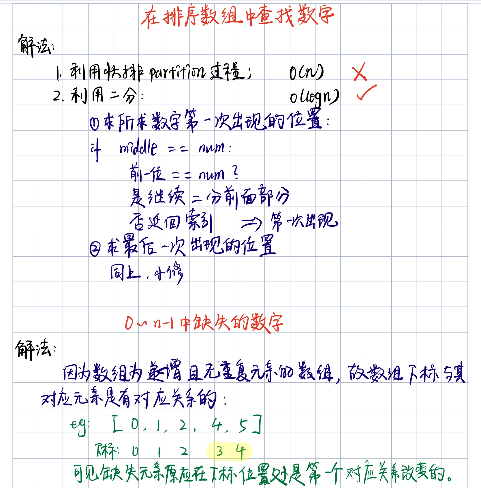
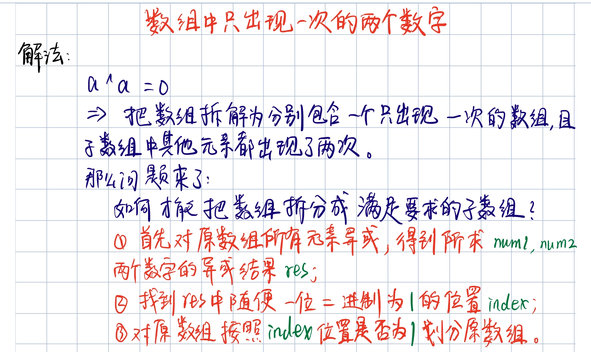
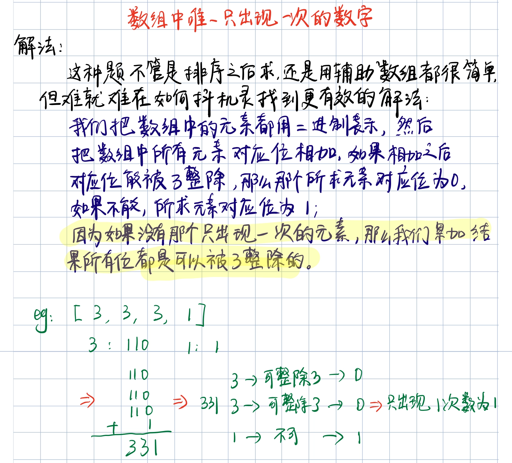
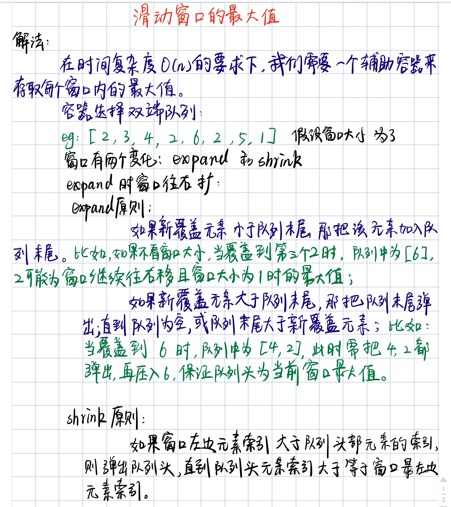
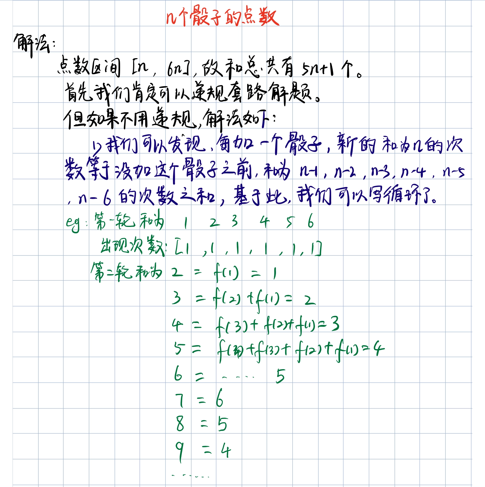
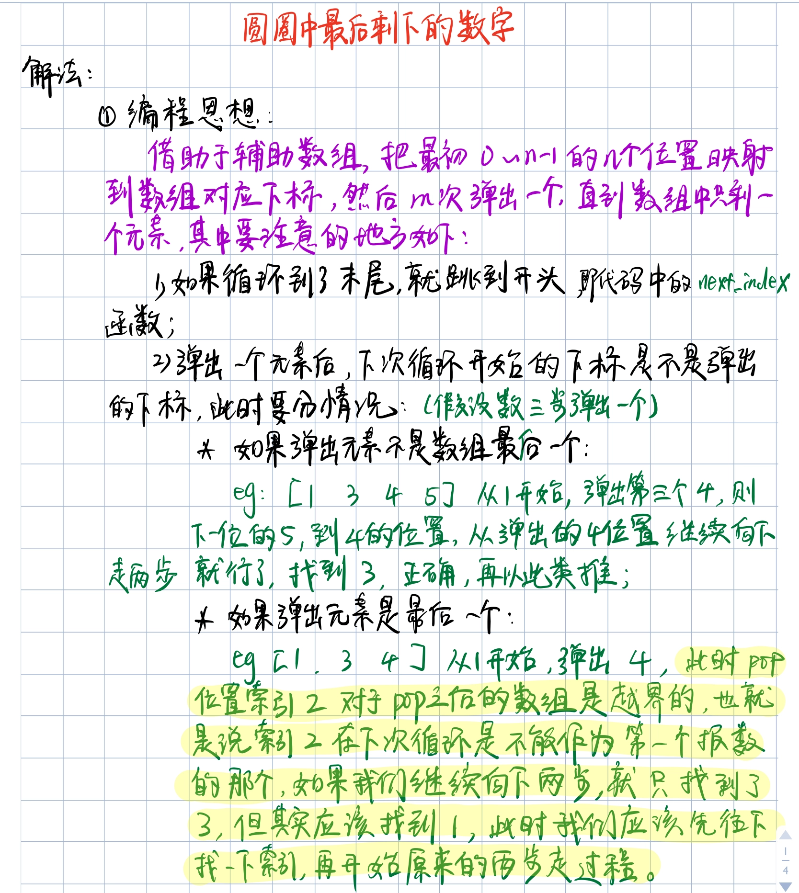
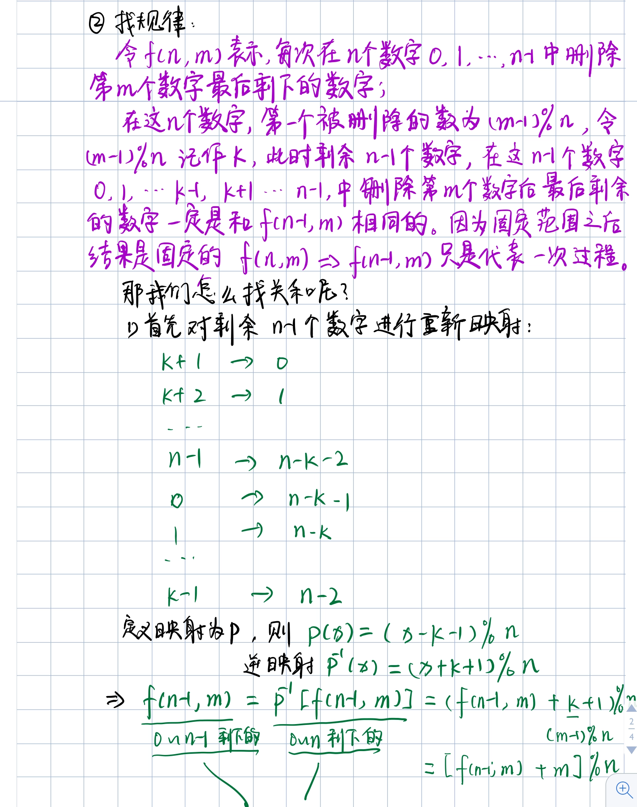

## 知识迁移能力
举一反三：能力是培养的，加油吧。


<!-- more -->

* * *
### 题 53：在排序数组中查找数字
#### 题目一：数字在排序数组中出现的次数
> 统计一个数字在排序数组中出现的次数。例如，输入排序数组{1，2，3，3，3，3，4，5}和数字 3，由于 3 在这个数组中出现了 4 次，因此输出 4.

#### 题目二：0~n-1 中缺失的数字
> 一个长度为 n-1 的递增排序数组中的所有数字都是唯一的，并且每个数字都在范围 0~n-1 之内。在范围 0~n-1 之内的 n 个数字中有且只有一个数字不在该数组中，请找出这个数字。

#### 题目三：数组中数值和下标相等的元素
> 假设一个单调递增的数组里的每个元素都是整数并且是唯一的。请编程实现一个函数，找出数组中任意一个数值等于其下标的元素。例如，在数组{-3， -1， 1， 3， 5}中，数字 3 和它的下标相等。

**解法：** <br>



```python
# -*- coding:utf-8 -*-
class Solution:
    def GetNumberOfK(self, data, k):
        """计算排序数组中数字出现的次数

        Arguments:
            data {list} -- 数组
            k {int} -- 待寻找数字

        Returns:
            int -- 找到返回个数，找不到返回 0
        """

        if k is None or len(data) < 1:
            return 0

        if k < data[0] or k > data[-1]:
            return 0

        first = self.get_occur_location(data, k, True)
        last = self.get_occur_location(data, k, False)
        if first == last and first == -1:
            return 0
        else:
            return last - first + 1

    def get_occur_location(self, data, k, first):
        right = len(data) - 1
        left = 0
        while left <= right:
            middle = left + ((right - left) >> 1)
            if data[middle] == k:
                if first:
                    if middle - 1 > -1 and data[middle-1] == k:
                        right = middle - 1
                    else:
                        return middle
                else:
                    if middle + 1 < len(data) and data[middle+1] == k:
                        left = middle + 1
                    else:
                        return middle
            elif data[middle] > k:
                right = middle - 1
            else:
                left = middle + 1

        return -1

    def get_missing_number(self, arr):
        """找到长度为 n-1 的递增排序数组中不在 0~n-1 范围内的数字

        Arguments:
            arr {list} -- 长度为 n-1 的递增排序数组
        """
        if arr is None or len(arr) < 1:
            return None

        return self.binary_find_missing_number(arr)

    def binary_find_missing_number(self, arr):
        left, right = 0, len(arr) - 1
        while left <= right:
            middle = left + ((right - left) >> 1)
            if arr[middle] == middle:
                left = middle + 1
            elif middle == 0 or (middle - 1 >= 0 and arr[middle-1] == middle-1):
                return middle
            else:
                right = middle - 1

        return -1

    def find_index_equls_value_item(self, arr):
        """找到单调递增且不重复数组中数值和下标相等的元素

        Arguments:
            arr {list} -- 数组

        Returns:
            int -- 找到返回下标，找不到返回 1
        """

        if arr is None or len(arr) < 1:
            return None

        return self.binary_find_equls_item(arr)

    def binary_find_equls_item(self, arr):
        left, right = 0, len(arr) - 1
        while left <= right:
            middle = left + ((right - left) >> 1)
            if arr[middle] == middle:
                return middle
            elif arr[middle] < middle:
                left = middle + 1
            else:
                right = middle - 1

        return -1


if __name__ == "__main__":
    nums = [1, 2, 3, 3, 3, 3]
    nums2 = [0, 1, 2, 3, 5]
    nums3 = [1, 2, 3, 4]
    nums4 = [-3, -1, 1, 3, 5]
    ex = Solution()
    print(ex.GetNumberOfK(nums, 3))
    print(ex.get_missing_number(nums2))
    print(ex.get_missing_number(nums3))
    print(ex.find_index_equls_value_item(nums4))
```

* * *

### 题 54：二叉搜索树的第 K 大节点
**题目：**
> 给定一颗二叉搜索树，请找出第 k 大的节点。

**解法：** <br>
利用二叉搜索树的中序遍历为递增数组的特性，即可得结果。

```python
# -*- coding:utf-8 -*-
class TreeNode:
    def __init__(self, x):
        self.val = x
        self.left = None
        self.right = None


class Solution:
    # 返回对应节点 TreeNode
    def KthNode(self, pRoot, k):
        if pRoot is None or k < 1:
            return None

        cur = pRoot
        res = -1
        while cur:
            most_right = cur.left
            if most_right:
                while most_right.right and most_right.right != cur:
                    most_right = most_right.right

                # 第一次遍历到 cur 节点
                if most_right.right is None:
                    most_right.right = cur
                    cur = cur.left
                    continue
                # 第二次遍历到 cur 节点
                if most_right.right == cur:
                    most_right.right = None

            k -= 1
            if k == 0:
                # 为了不破坏原二叉树结构，没有直接返回 cur 节点
                res = cur
            cur = cur.right
        return None if res == -1 else res


if __name__ == "__main__":
    root = TreeNode(5)
    root.left = TreeNode(3)
    root.right = TreeNode(7)
    root.left.left = TreeNode(2)
    root.left.right = TreeNode(4)
    root.right.left = TreeNode(6)
    root.right.right = TreeNode(8)
    ex = Solution()
    print(ex.KthNode(root, 4)) # The answer is TreeNode(5)
```


* * *
### 题 55： 二叉树的深度
#### 题目一： 求二叉树的深度
> 输入一课二叉树的根节点，求该树的深度。

```python
class Solution:
    def TreeDepth(self, pRoot):
        if pRoot is None:
            return 0

        depthl = self.TreeDepth(pRoot.left)
        depthr = self.TreeDepth(pRoot.right)

        return max(depthl, depthr) + 1
```

#### 题目二： 平衡二叉树
> 输入一课二叉树的根节点，判断该树是不是平衡二叉树。

**解法：** <br>
这个题在我前面关于树形 dp 的帖子里。


* * *
### 题 56：数组中数字出现的次数
#### 题目一：数组中只出现一次的两个数字
> 一个整型数组里除两个数字之外，其他数字都出现了两次。请写程序找出这两个只出现一次的数字。要求时间复杂度是 O(n),空间复杂度是 O(1).

**解法：** <br>
空间复杂度 O(1)意味着我们不能借用辅助数组。解法如下：


```python
# -*- coding:utf-8 -*-
class Solution:
    # 返回[a,b] 其中 ab 是出现一次的两个数字
    def FindNumsAppearOnce(self, array):
        if array is None or len(array) < 2:
            return []

        res = self.get_xor(array)

        flag = self.get_index(res)
        help_arr1, help_arr2 = [], []
        for item in array:
            res = self.get_bit(item, flag)
            if res:
                help_arr1.append(item)
            else:
                help_arr2.append(item)

        return [self.get_xor(help_arr1), self.get_xor(help_arr2)]

    def get_xor(self, arr):
        res = 0
        for item in arr:
            res = res ^ item

        return res

    def get_index(self, res):
        """得到异或结果其中一位为 1 的位置

        Arguments:
            res {int} -- 原数组异或结果
        """
        period = 0
        while period < 32:
            if res & 1 == 1:
                return period
            res = res >> 1
            period += 1

    def get_bit(self, num, index):
        # 将给定 index 位置的 bit 移到最低位
        while index > 0:
            num = num >> 1
            index -= 1

        return num & 1


if __name__ == "__main__":
    ex = Solution()
    nums = [2, 4, 3, 6, 3, 2, 5, 5]
    print(ex.FindNumsAppearOnce(nums)) # The answer is [6, 4].
```

#### 题目二：数组中唯一只出现一次的数字。
> 在一个数组中除一个数字只出现一次之外，其他数字都出现了三次。请找出那个只出现了一次的数字。

**解法：** <br>



```python
# -*- coding=utf-8 -*-


class Solution():
    def find_item(self, arr):
        if arr is None or len(arr) < 4 or len(arr) % 3 != 1:
            return None

        temp = [0 for i in range(32)]
        for item in arr:
            bit_mark = 1
            for i in range(31, -1, -1):
				# 使用 bit_mark 每次左移结果去与可以防止溢出
                bit = item & bit_mark
                if bit != 0:
                    temp[i] += 1
                bit_mark = bit_mark << 1

        res = 0
        # 注意生成数时候的顺序
        for _ in temp:
            res = res << 1
            res += _ % 3

        return res

if __name__ == "__main__":
    ex = Solution()
    arr = [3, 3, 3, 1]
    print(ex.find_item(arr))
```


* * *
### 题 57：和为 s 的数字

#### 题目一：和为 s 的两个数字
> 输入一个递增排序的数组和一个数字 s，在数组中查找两个数，使得它们的和正好是 s。如果有多对数字的和等于 s，则输出任意一对即可。

**解法：** <br>
因为数组是递增的，那就好办了，首尾相加求和，然后往里推进。

```python
# -*- coding=utf-8 -*-

def two_sum(arr, g_sum):
    if arr is None or len(arr) < 2:
        return None

    start, end = 0, len(arr) -1
    while start < end:
        if arr[start] + arr[end] == g_sum:
            return arr[start], arr[end]
        elif arr[start] + arr[end] < g_sum:
            start += 1
        else:
            end -= 1

    return None


if __name__ == "__main__":
    arr = [1, 2, 4, 7, 11, 15]
    g_sum = 15
    print(two_sum(arr, g_sum))
```

#### 题目二：和为 s 的连续正数序列
> 输入一个正数 s，打印出所有和为 s 的连续正数序列（至少含有两个数）。例如，输入 15，由于 1+2+3+4+5=4+5+6=7+8=15，所以打印出 3 个连续序列 1~5，4~6 和 7~8.

**解法：** <br>
类比题目一，构建初始区间，然后检测条件，根据条件更改区间。

```python
def get_sequence(g_sum):
    if g_sum < 3:
        return None

    small, big = 1, 2
    res = []
    while small <= g_sum // 2:
        cur_sum = sum(range(small, big+1))
        if cur_sum == g_sum:
            res.append((small, big))
            big += 1
        elif cur_sum < g_sum:
            big += 1
        else:
            small += 1

    return res


if __name__ == "__main__":
    print(get_sequence(15))
```

* * *
### 题 58：翻转字符串
#### 题目一：翻转单词顺序
> 输入一个英文句子，翻转句子中单词的顺序，但单词内字符的顺序保持不变。为简单起见，标点符号和普通字母一样处理。例如输入字符串“I am a student.”,则输出“student. a am I”.

**解法：** <br>
这个题用 Python 写也跟作弊似的。但是有正经解法的，正经解法是先把字符串整个翻转，然后再以空格为区分，翻转字符串里的每一个单词。

```python
# -*- coding:utf-8 -*-
class Solution:
    def ReverseSentence(self, s):
        if s is None or len(s) < 1:
            return s
        # 排除只含有空格的字符串
        if s.strip() == '':
            return s

        s = s.split()
        return ' '.join(s[::-1])
```


#### 题目二：左旋转字符串
> 字符串的左旋转操作是字符串前面的若干个字符转移到字符串尾部。请定义一个函数实现字符串左旋转操作的功能。比如，输入字符串"abcdefgt" 和数字 2，该函数将返回左旋转两位得到的结果“cdefgab"
”

**解法：** <br>
这个用 Python 切片可以作弊式完成。但建议非 Python 语言使用者还是用正经解法把：<br>
1.首先用给定数字把字符分成两部分，第一部分为待左移字符串，第二部分为原剩余字符串；<br>
2.再分别翻转这两个部分；<br>
3.将这两个部分合并起来，然后再翻转合并后的字符串。

```python
# -*- coding:utf-8 -*-
class Solution:
    def LeftRotateString(self, s, n):
        if s is None or len(s) < 1:
            return s

        n = n % len(s)
        pre, post = s[:n], s[n:]
        return post + pre
```

* * *
### 题 59：队列的最大值
#### 题目一：滑动窗口的最大值
> 给定一个数组和滑动窗口的大小，请找出所有滑动窗口里的最大值。例如，如果输入数组{2，3，4，2，6，2，5，1}及滑动窗口的大小 3，那么一共存在 6 个滑动窗口，它们的最大值分别为{4，4，6，6，6，5}.

**解法：** <br>



```python
# -*- coding:utf-8 -*-
from collections import deque


class Solution:
    def maxInWindows(self, num, size):
        if num is None or size is None:
            return []
        if size < 1 or size > len(num):
            return []

        res = []
        helper = deque()
        for i in range(size):
            self.expand(num, i, helper)
        res.append(num[helper[0]])

        l = 0
        for i in range(size, len(num)):
            self.expand(num, i, helper)
            l += 1
            self.shrink(num, l, helper)
            res.append(num[helper[0]])

        return res

    def expand(self, num, index, helper):
        if not helper:
            helper.append(index)
        elif num[index] < helper[-1]:
            helper.append(index)
        else:
            while helper and num[index] >= num[helper[-1]]:
                helper.pop()
            helper.append(index)

    def shrink(self, num, l, helper):
        while helper and helper[0] < l:
            helper.popleft()


if __name__ == "__main__":
    ex = Solution()
    num = [2, 3, 4, 2, 6, 2, 5, 1]
    print(ex.maxInWindows(num, 3))
```

#### 题目二：队列的最大值
> 请定义一个队列并实现 max 得到队列里的最大值，要求函数`max`，`push_back` 和`pop_front`的时间复杂度都是 O(1)。

**解法：** <br>
借用上题的思想，给队列建立一个影子队列用来存放最大值，当队列添加一个元素的时候，影子队列执行`expand`操作，当队列`pop_front`的时候，影子队列执行一次`shrink`操作。

```python
# -*- coding=utf-8 -*-
from collections import deque


class WithMaxQueue():
    """能 O(1)时间复杂度返回队列最大值的队列实现：
    实现了 pop_front 以及 push_back 方法
    """

    def __init__(self):
        """初始化，self.__l, self.__r 两个参数很重要
        params:
        self.__queue:  存储数据的队列
        self.__shadow: 存储数据队列中最大值的队列
        self.__l:      等价于滑动窗口左边界，表示当前队列头部是第几个添加进来的元素
        self.__r:      等价于滑动窗口右边界，表示当前队列尾部是第几个添加进来的元素
        """

        self.__queue = deque()
        self.__shadow = deque()
        self.__l, self.__r = 0, 0

    def push_back(self, item):
        self.__queue.append(item)
        self.expand(item)
        self.__r += 1

    def pop_front(self):
        if self.__queue:
            self.__queue.popleft()
            self.__l += 1
            self.shrink()
        else:
            raise IndexError("pop from emtpy queue")

    def expand(self, item):
        """滑动窗口的扩大过程：即当有新元素时，对最大值队列的调整
        """

        if not self.__shadow:
            self.__shadow.append((self.__r, item))
        else:
            if item < self.__shadow[-1][-1]:
                self.__shadow.append((self.__r, item))
            else:
                while self.__shadow and item >= self.__shadow[-1][-1]:
                    self.__shadow.pop()
                self.__shadow.append((self.__r, item))

    def shrink(self):
        """滑动窗口的缩小过程（窗口左边界右移）即：当弹出元素时，对最大值队列的调整
        """

        while self.__shadow and self.__l > self.__shadow[0][0]:
            self.__shadow.popleft()

    def get_max(self):
        return self.__shadow[0][-1]


if __name__ == "__main__":
    ex = WithMaxQueue()
    num = [2, 3, 4, 2, 6, 2, 5, 1]
    # The anster is 4, 4, 6, 6, 6, 5
    for i in range(3):
        ex.push_back(num[i])
    print(ex.get_max())
    for i in range(3, len(num)):
        ex.push_back(num[i])
        ex.pop_front()
        print(ex.get_max())
```

* * *
## 抽象建模能力
建模两步走：
1. 选择合理的数据结构来表述问题；
2. 分析模型中的内在规律，并用编程语言表述这种规律。

* * *
### 题 60：n 个骰子的点数
> 把 n 个骰子扔在地上，所有骰子朝上一面的点数之和为 s。输入 n，打印出 s 的所有可能值出现的概率。

**解法：**


```python
# -*- coding=utf-8 -*-
import numbers
import time


class Solution():
    """求 n 个骰子扔在地上，所有骰子正面向上点数和 s 的各种情况及其出现概率
    """

    def __init__(self, dice=6):
        self.dice_numbers = dice

    def get_sum_recur(self, n):
        """递归求解版本

        Arguments:
            n {int} -- 骰子个数

        Returns:
            list -- 包含元素为（s, probability）, s 为和，probability 为 s 出现概率。
        """

        assert isinstance(n, numbers.Integral)
        if n < 1:
            return [(0, 1)]

        res_arr = [0 for i in range((self.dice_numbers - 1) * n + 1)]
        self.recur_process(n, res_arr)

        total = self.dice_numbers ** n
        res_arr = [(i + n, res_arr[i] / total) for i in range(len(res_arr))]

        return res_arr

    def recur_process(self, n, res_arr):
        for i in range(1, self.dice_numbers + 1):
            self.process(n, n, i, res_arr)

    def process(self, n, remain, cur_sum, res_arr):
        if remain == 1:
            res_arr[cur_sum - n] += 1
        else:
            for i in range(1, self.dice_numbers+1):
                self.process(n, remain-1, cur_sum+i, res_arr)

    def get_sum(self, n):
        """非递归求解版本
        """

        assert isinstance(n, numbers.Integral)
        if n < 1:
            return [(0, 1)]

        p1 = [0] * 2
        p1[0] = [0 for i in range(self.dice_numbers*n+2)]
        p1[1] = [0 for i in range(self.dice_numbers*n+2)]
        # flag 用来每次循环时，复用上轮循环的结果
        flag = 0
        for i in range(1, self.dice_numbers+1):
            p1[flag][i] = 1

        for i in range(2, n+1):
            for j in range(i):
                # 和不可能小于 i
                p1[1-flag][j] = 0
            for j in range(i, self.dice_numbers*i+1):
                p1[1-flag][j] = 0
                k = 1
                while k <= self.dice_numbers and k < j:
                    p1[1-flag][j] += p1[flag][j-k]
                    k += 1
            flag = 1 - flag

        total = self.dice_numbers ** n

        res = []
        for i in range(n, self.dice_numbers*n+1):
            res.append((i, p1[flag][i]/total))

        return res


if __name__ == "__main__":
    n = 10
    print('{}个骰子的情况下：'.format(n))
    ex = Solution()
    start = time.time()
    print("递归求解结果：\n{}".format(ex.get_sum_recur(n)))
    first_period = time.time() - start

    print("非递归求解结果：\n{}".format(ex.get_sum(n)))
    second_period = time.time() - start - first_period

    print("递归用时：{}, 非递归用时：{} \n 递归用时是非递归用时的 {} 倍。".format(
        first_period, second_period, first_period/second_period))
```

当 n=10 的时候，就已经能看见巨大差距了：

```
递归用时：24.436681985855103, 非递归用时：0.0007491111755371094
递归用时是非递归用时的 32620.90165499682 倍。
```

### 题 61：扑克牌中的顺子
> 从扑克牌中随机抽 5 张牌，判断是不是一个顺子，即这五张牌是不是连续的。2~10 为数字本身，A 为 1， J 为 11， Q 为 12，K 为 13，而大小王可以看成任意数字。

**解法：**
这类题就是看看代码能力了。<br>
有两点需要注意：<br>
1.数组中不能出现除了 0 之外的重复数字；
2.连续的非零数字之间的正常间距为 1

```python
# -*- coding:utf-8 -*-
class Solution:
    def IsContinuous(self, numbers):
        if numbers is None or len(numbers) != 5:
            return []

        numbers.sort()
        length = len(numbers)

        times = numbers.count(0)
        for i in range(length-1):
            if numbers[i] == 0:
                continue
            delta = numbers[i+1] - numbers[i]
            if delta == 0:
                return False
            elif delta - 1 <= times:
                times -= delta - 1
            else:
                return False

        return True


if __name__ == "__main__":
    nums = [1, 3, 2, 6, 4]
    ex = Solution()
    print(ex.IsContinuous(nums))
```

### 题 62：圆圈中最后剩下的数字
> 0,1,..., n-1 这 n 个数字排成一个圆圈，从数字 0 开始，每次从这个圆圈里出去第 m 个数字，求这个圆圈里剩下的最后一个数字。

**解法：**




```python
# -*- coding:utf-8 -*-
class Solution:
    def LastRemaining_Solution_1(self, n, m):
        """利用辅助数组解法

        Arguments:
            n {int} -- 人数
            m {int} -- 删除第 m 个元素

        Returns:
            int -- 最后剩余人代号
        """

        if n < 1 or m < 0:
            return -1

        arr = [i for i in range(n)]
        cur = 0
        while len(arr) != 1:
            period = m - 1
            while period:
                cur = self.next_index(arr, cur)
                period -= 1
            arr.pop(cur)
            if cur >= len(arr):
                cur = 0

        return arr[-1]

    def next_index(self, arr, cur):
        return 0 if cur >= len(arr) - 1 else cur + 1


    def LastRemaining_Solution_2(self, n, m):
        """f(n, m) = (f(n - 1, m) + m) % n
        如果不做映射，f(n-1, m)结果相当于 f(n, m)淘汰第一个人之后的下一步，但调整了剩余的 n-1
        人的代号之后，我们需要确定的映射关系，能把调整之后的代号转换到初始包含 n 个人的情况下的代号
        这样返回的结果也是和最初数据对应的。
        """

        if n < 1 or m < 1:
            return -1

        last = 0
        for i in range(2, n+1):
            last = (last + m) % i

        return last

if __name__ == "__main__":
    ex = Solution()
    n, m = 5, 3
    print(ex.LastRemaining_Solution_2(n, m))
```


### 题 63：股票的最大利润
> 假设把某股票的价格按照时间先后顺序存储在数组中，请问买卖该股票一次可能获得的最大利润是多少？例如，一只股票在某些时间节点的价格为{9， 11， 8，5，7， 12， 16， 14}。如果我们能在价格为 5 的时候买入并在价格为 16 时卖出，则能收获最大利润 11.

```python
# -*- coding=utf-8 -*-


def get_max_profit(arr):
    if arr is None or len(arr) < 2:
        return 0

    min_price = arr[0]
    max_profit = arr[1] - min_price
    for item in arr[2:]:
        if item < min_price:
            min_price = item
        max_profit = max(max_profit, item - min_price)

    return max_profit


if __name__ == "__main__":
    num = [9, 11, 8, 5, 7, 12, 16, 14]
    print(get_max_profit(num))  # The anster is 11
```


## 发散思维能力：
积累越多，发散能力自然越强，加油！

### 题 64：求 1+2+...+n
> 求 1+2+...+n，要求不能用乘除法、for、while、if、else、switch、case 等关键字及条件判断语句（A?B:C）

**解法：** <br>
短路求值：<br>
对于 Python 来说：`a and b if a return b else return a`

```python
# -*- coding:utf-8 -*-
class Solution:
    def Sum_Solution(self, n):
        if n < 1:
            return 0
        ans = n
        emp = n and self.Sum_Solution(n-1)
        ans += temp
        return ans
```


### 题 65：不用加减乘除做加法
> 写一个函数，求两个整数之和，要求函数体内不得使用“+”、“\_”、“\*”、“/”四则运算符号

**解法：**
Python 中的位操作和其他语言是有些许不同的。

```python
# -*- coding:utf-8 -*-
class Solution:
    def Add(self, a, b):
        while(b & 0xFFFFFFFF > 0): # 防止 b 溢出 32 位范围
            a, b = (a ^ b), ((a & b) << 1)
		# 判断 a 是否溢出
        if abs(a) >= 0xFFFFFFFF:
            return a & 0xFFFFFFFF
        return a
```


### 题 66：构建乘积数组
> 给定一个数组 A[0,1, ... n-1], 请构建一个数组 B[0,1,...,n-1],其中 B 中的元素 B[i] = A[0]xA[1]x...xA[i-1]xA[i+1]x..xA[n-1]。不能使用除法。

**解法：** <br>
这个题如果自己解，就只有用笨办法了，但剑指 offer 提供的这种解法未免太 6 了，分成两部分，同时代码实现也很巧妙，Python 版如下，请飨。

```python
# -*- coding=utf-8 -*-


def get_multi_list(arr):
    if arr is None or len(arr) < 1:
        return -1
    if len(arr) == 1:
        return arr

    length = len(arr)
    res = [0 for i in range(len(arr))]

    res[0] = 1
    for i in range(1, length):
        res[i] = res[i-1]*arr[i-1]

    temp = 1
    for j in range(length-2, -1, -1):
        temp *= arr[j+1]
        res[j] *= temp

    return res


if __name__ == "__main__":
    num = [1, 2, 3, 4, 5]
    print(get_multi_list(num))
```
